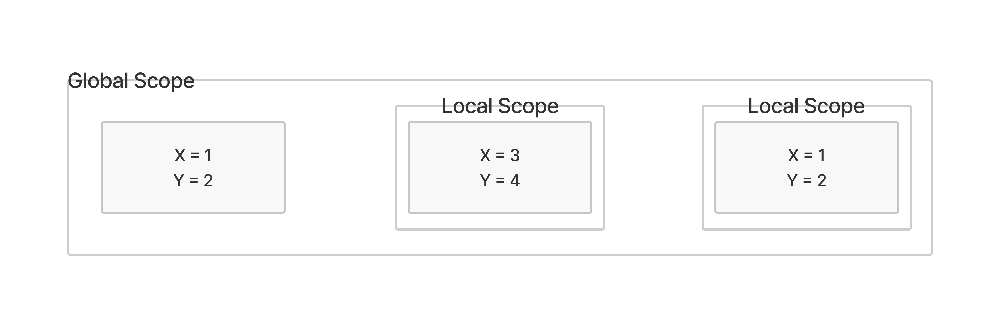
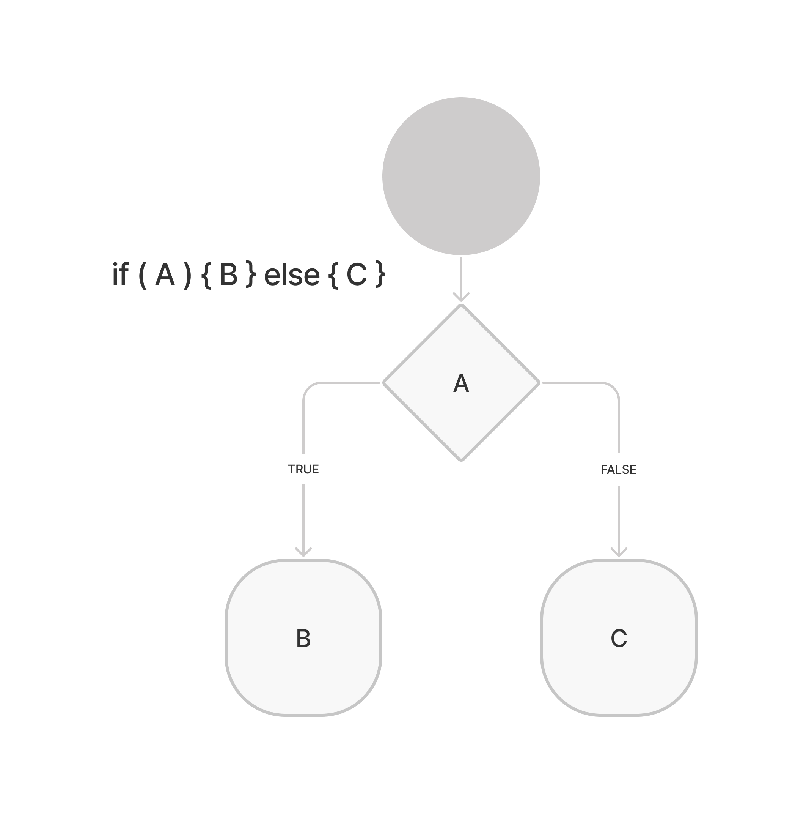
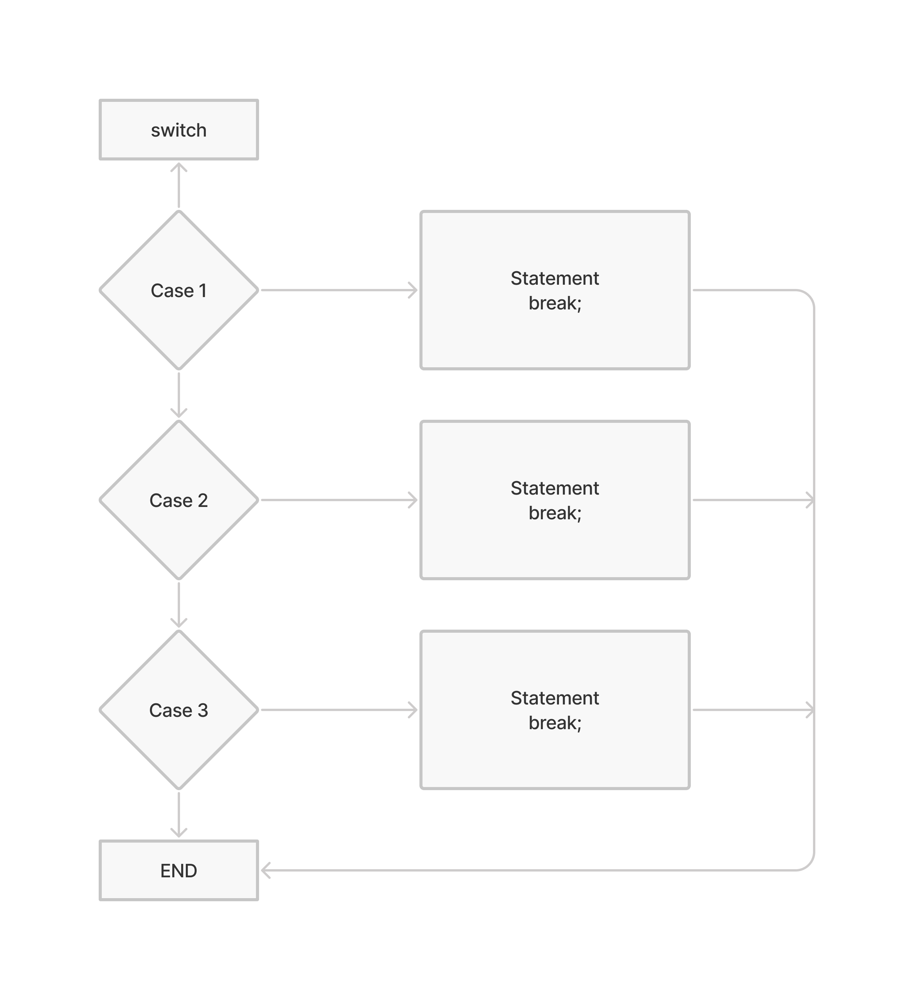
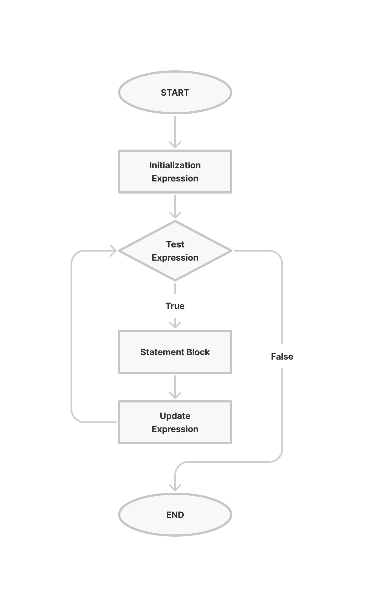
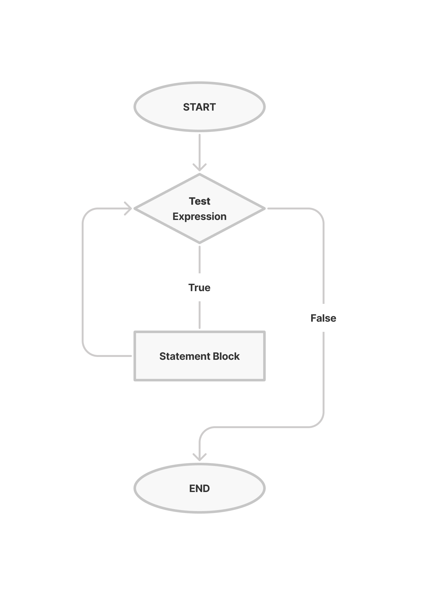
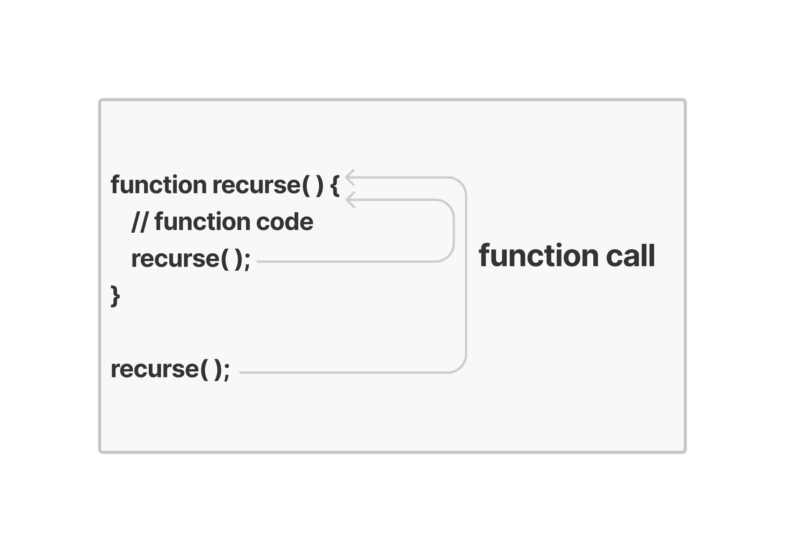
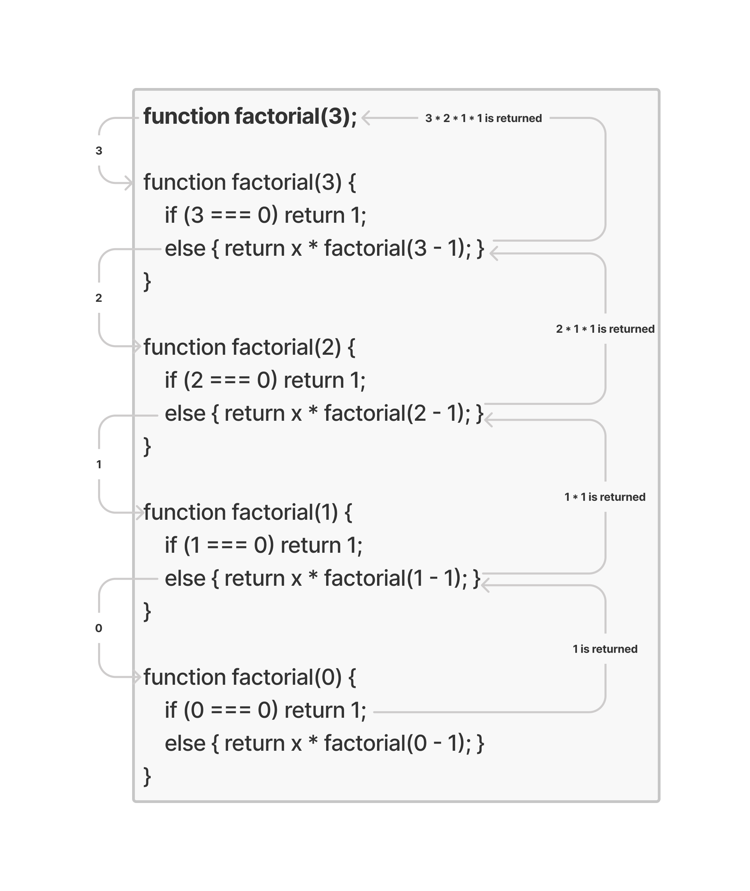
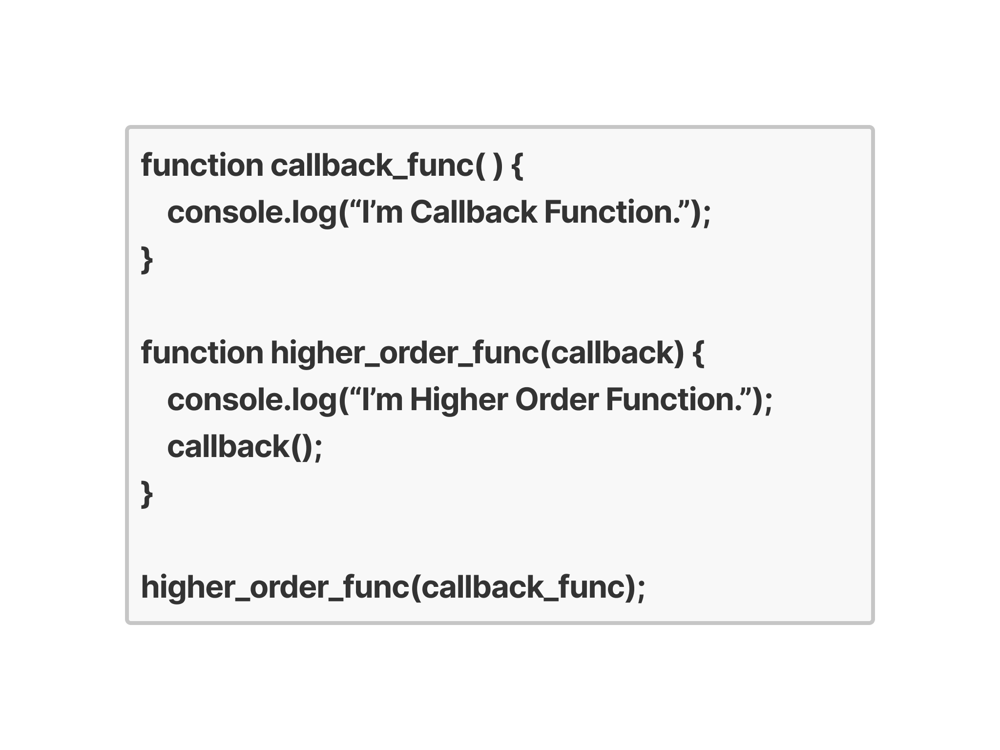
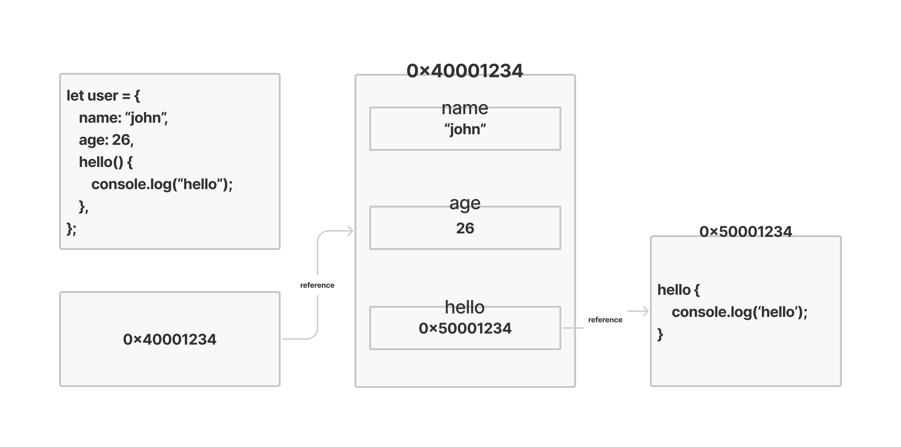
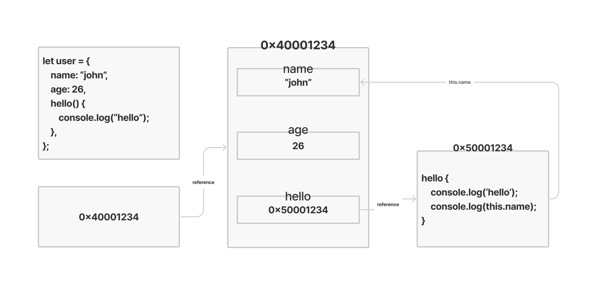

# JAVASCRIPT
> 👍 *기초를 탄탄하게🧱, 발목 잡히지 않도록.*

## 📌 개요
<!-- ### Basic
### Condition
### Iteration
### Function
### Basic Object -->

### 학습 환경 구축
#### Node.js
[Download](https://nodejs.org/ko/download/)
- V8(Javascript Engine)으로 빌드된 이벤트 기반 JS Runtime Platform
- 확장성 있는 네트워크 애플리케이션(특히, Server Side) 개발에 사용되는 SW Platform
- JS를 활용하며, Non-blocking I/O와 단일 스레드 이벤트 루프를 통한 높은 성능으로 처리가 가능하다.

#### Visual Studio Code
[Download](https://code.visualstudio.com/download)

#### LeetCode
[LeetCode](https://leetcode.com/)
- 온라인 기반으로 알고리즘 문제 풀이 및 토론 환경을 제공하는 플랫폼 사이트
- JS, C, C++, Python 등 14개의 인기 있는 코딩 언어를 지원
- Facebook, Apple, Intel, Amazon 등 해외 기업에서 SW 문제 해결 인터뷰 시 활용

### Javascript란?
- 객체(Object) 기반의 스크립트 프로그래밍 언어(Line by Line interpreter)
- ECMAScript 사양을 준수하는 범용 스크립팅 언어
- 웹의 동적 동작을 구현하기 위해 제작
- JS 엔진(Google V8, Firefox SpiderMonkey, Edge Chakra) 위에서 수행된다.

### ECMAScript란?
- ECMA International(정보통신에 대한 표준을 제정하는 비영리 표준화 기구)이 ECMA-262 기술 규격(범용 목적의 스크립트 언어 명세 기술)에 따라 정의하고 있는 표준화된 스크립트 프로그래밍 언어
- JS를 표준화하기 위해 만들어졌다.

### 코드의 동작 흐름
- 개발자 -> 스크립트 -> 컴퓨터


### Javascript 변환 절차
- Javascript 코드를 parser가 변환해서 Abstract Syntax Tree(추상 문맥 트리)로 변환되어 의미에 맞게 나누어진 후, 컴파일러 또는 인터프리터를 통해서 실제 컴퓨터가 이해할 수 있는 언어로 변환되고, 이를 CPU가 읽어서 실행한다.

## 📌 기본 입출력
- 사용자가 프로그램과 상호작용하기 위한 방법으로, 입력과 출력, 즉 Input/Output(I/O)를 의미한다.
- 운영체제에서의 대표적인 입출력은 표준 입력(stdin), 표준 출력(stdout), 표준 오류 출력이 있다.
  * **표준 입력(stdin)**
    일반적으로 컴퓨터의 키보드의 응답을 받아 입력
    프로그램의 데이터를 추가하기 위한 입력 장치
    알고리즘에서는 문제의 TestCase 입력을 위해 사용한다.
  * **표준 출력(stdout)**
    일반적으로 컴퓨터의 모니터에 문자열로 출력
    프로그램의 실행 상태 혹은 실행 결과를 보고 판단
    알고리즘에서는 문제의 정답 확인, 디버깅 용으로 사용한다.
```txt
Hello, world!
```

```javascript
const fs = require("fs");
const input = fs.readFileSync("./Javascript/input.txt", "utf8");

console.log(input);
```
> 이 경우, readFileSync에서 경로를 절대 경로로 지정해야 node.js로 출력이 가능한 것 같다.

## 📌 Javascript 기초 문법
### 코드 구성
- Javascript 문법은 스크립트 기반의 언어로, 다수의 표현식(Expression)과 하나의 명령문(Statement)로 이루어지며, 명령문으로 프로그램(Application)이 수행된다.
- 하나의 명령문(Statement)의 끝은 개행(`Enter`) 혹은 **세미콜론(`;`)**으로 표시한다.

### 예약어(Keyword)
[W3Schools](https://www.w3schools.com/js/js_reserved.asp)
- Javascript 문법을 만들 때 미리 정해진 용도로 동작하기 위해 정의된 단어.

### 식별자(Identifier)
- 스크립트에서 변수나 함수에 이름을 붙일 때 사용하는 단어.
- 대소문자를 구별하며, 유니코드 문자를 이용한다.
- **Javascript 식별자 규칙**
  * 예약어(Keyword) 사용 불가
  * 숫자로 시작 불가능
  * 특수문자는 `_`, `$`만 가능
  * 공백 포함 불가능

### 주석(Comments)
- 프로그램 구현 시 개발자의 설명 및 이해를 쉽게 도와주는 문장으로, 실제 코드의 실행에는 포함되지 않는다.
  `// 단일 행 주석`
  `/* 다중 행 주석 */`  
```javascript
console.log('hello'); // hello message(single line comments)

console.log("Hello");
/* Hello Message
Multi line
Comments
*/
```

## 📌 Javascript 변수와 상수
### 변수
- **변경 가능**한 값을 저장하기 위한 기억 공간(Memory)
- 사용하기 전 반드시 선언을 해야 한다.
- 중복해서 선언할 수 없다.
  *SyntaxError: Identifier '변수명' has already been declared* 발생
- 예약어(keyword) `let`을 활용한다.


### 상수
- **변경 불가능**한 값을 저장하기 위한 기억 공간(Memory)
- 사용하기 전 반드시 선언을 해야 한다.
- 중복해서 선언할 수 없다.
  *SyntaxError: Identifier '변수명' has already been declared* 발생
- 예약어(keyword) `const`을 활용한다.
- 값을 재할당할 수 없다.
  *TypeError: Assignment to constant variable.* 발생
- 상수의 경우 선언과 값 초기화를 동시에 해야한다.
  *SyntaxError: Missing initializer in const declaration* 발생


### Hoisting
- 코드에 선언된 변수 및 함수를 유효한 범위의 코드 상단으로 끌어올리는 작업을 의미한다.
- 예약어(keyword) `var`를 사용한 변수/함수의 선언만 위로 올려지고, 할당은 올려지지 않는다.
- 예약어(keyword) `let`, `const`로 선언한 변수/상수와 함수 표현식에서는 Hoisting 현상이 발생하지 않는다.
  *ReferenceError: Cannot access '변수명' before initialization* 발생

## 📌 Javascript 자료형
- 목적에 따라 특별한 성질이나 정해진 범주를 가지고 있는 데이터의 종류.
- 7가지의 원시형과 1가지의 객체형으로 구성된다.
### `typeof`
- 인수의 자료형을 반환하는 연산자/함수.
  연산자: `typeof x`
  함수: `typeof(x)`
### 자료형의 종류

| <center>DATA TYPE</center> | <center>DESC</center> | <center>CATEGORY</center> |
|:-:|:-|:-:|
|Boolean|논리적 값으로, `true`, `false`|원시 자료형(primitive type)|
|`null`|존재하지 않거나, 유효하지 않은 주소 표시|원시 자료형(primitive type)|
|`undefined`|선언 후 값을 할당하지 않은 변수|원시 자료형(primitive type)|
|number|정수, 실수 등의 숫자|원시 자료형(primitive type)|
|string|빈 문자열이나 글자들을 표현하는 문자열|원시 자료형(primitive type)|
|symbol|문자열과 함께 객체 property로 사용|원시 자료형(primitive type)|
|bigint|2<sup>53</sup>이상의 정수|원시 자료형(primitive type)|
|object|둘 이상의 복잡한 개체 저장 가능|객체형(object type)|

#### Boolean
- 논리적인 값을 표현하는 자료형.
- `true`, `false` 두 가지 값만 존재한다.
- 직접 사용하여 **flag 변수**로 활용할 수 있다.
- 주로 조건문 등에서 동작 판단의 기준으로 사용한다.
```javascript
let nameCheck = true;
let ageCheck = false;
let valueCheck = 10 > 3;    // true

console.log(nameCheck, ageCheck, valueCheck);
```

#### `null`
- 값이 비어 있음을 표현하는 자료형.
- 존재하지 않는(nothing), 비어 있는(empty), 알 수 없는(unknown) 값을 나타내는 데 활용한다.
- 하위 버전과의 호환성 문제를 해결하기 위해 `object` type으로 명시된다.

#### `undefined`
- 값이 할당되어 있지 않은 상태를 나타내는 자료형.
- 변수 선언 후 초기화하지 않은 경우에 `undefined`가 자동으로 할당된다.

#### number
- 정수, 부동소수점 숫자를 표현하는 자료형.
- 사칙연산을 할 수 있다. 다만, 부동소수점 숫자 연산은 완벽하지 않다.
- 일반적인 숫자 이외에 `Infinity`, `-Infinity`, `NaN`(Not a Number)와 같은 특수 숫자 값이 존재한다.
- 2<sup>53</sup>-1보다 큰 값은 bigint 자료형으로 표기한다.

#### string
- 문자, 문자열을 표현하는 자료형.
- 3가지 종류의 따옴표로 표현할 수 있다.
  `"_"` 큰 따옴표
  `'_'` 작은 따옴표
  ``_`` 역 따옴표(backtick), 문자열 내부에 변수를 활용할 수 있음.

#### object
- 다수의 원시 자료형(primitive type) 혹은 복잡한 개체(entity)를 표현하는 자료형.
- `Object()` 혹은 중괄호(`{}`)를 활용해 생성한다.
- `key: value` 구조를 가지며, 접근은 `objectName.keyName` 형태로 표현한다.

> 객체로 선언한 변수(`User`)에는 해당 데이터(`name`, `age`)가 각각 들어가는 것이 아니라, 해당 데이터를 보유한 Memory의 주소(`0x12341234`)가 할당된다.

- 객체에 개체(entity)를 추가하기 위해서는 `objectName.keyName = value;`으로 할 수 있고, 삭제는 `delete` 명령어를 활용해 할 수 있다.

##### 객체 자료형 복사의 문제
- 객체의 값을 복사하면, 대상 전체가 아닌, 주소 값만 복사되기 때문에 복사한 객체를 수정하면, 원본 객체도 수정되는 문제가 발생한다.
- 따라서 가리키는 객체 전체를 복사하기 위해서는 얕은 복사(Shallow Copy), 깊은 복사(Deep Copy)를  사용해야 한다.


##### 얕은 복사(Shallow Copy)
1. 반복문 `for`문을 활용한 객체의 얕은 복사(Shallow Copy)
   - [참고자료]()
2. Object.assign(피복사 객체, 복사 객체) 함수를 활용한 객체의 얕은 복사(Shallow Copy)
   - [참고자료](https://developer.mozilla.org/ko/docs/Web/JavaScript/Reference/Global_Objects/Object/assign)
3. Spread Operator를 활용한 객체의 얕은 복사(Shallow Copy)
   - [참고자료]()
4. 얕은 복사(Shallow Copy)의 문제점
   - 객체 내부에 또 다른 객체가 있는 경우, 복사되지 않는다.
   
##### 깊은 복사(Deep Copy)
- 객체 내부의 객체도 복사한다.
1. 재귀 함수(`for`문)를 이용한 객체의 깊은 복사
2. `JSON.parse(JSON.stringify(원본 객체))`를 이용한 객체의 깊은 복사

#### 형 변환
- Javascript는 자료형을 명시적으로 선언할 필요가 없다.
- 따라서, 연산자로 인한 계산이나 변수에 전달되는 값은 자동으로 암묵적인 형 변환이 실행된다.
- 다만, 강제적으로 자료형을 변환하려면, **자료형 함수**를 이용해 명시적으로 변환시켜야 한다.

##### 자료형 함수
1. `String()`
2. `Number()`, `parseInt()`, `parseFloat()`
3. `Boolean()`

## 📌 Javascript 연산자
- 프로그램에서 데이터를 처리해 결과를 산출할 목적으로 사용되는 문자.
  * 단항 연산자: 부호(`+`, `-`), 증감 연산자(`++`, `--`), 논리 연산자(`!`), 비트 연산자(`~`)
  * 이항 연산자: 산술 연산자(`+`, `-`, `*`, `/`, `%`), 대입 연산자(`=`, `+=`, `-=`), 비교 연산자(`==`, `!=`), 논리 연산자(`&&`, `||`)
  * 삼항 연산자: 조건부 삼항 연산자
- [연산자 우선순위 참고자료](https://developer.mozilla.org/ko/docs/Web/JavaScript/Reference/Operators/Operator_Precedence#%ED%91%9C)

1. 산술 연산자
   - 수학적 계산을 위해 제공하는 연산자.
   - 사칙 연산과 나머지, 거듭제곱 연산자 등이 있다.
2. 대입 연산자
   - 계산 결과를 하나의 변수에 할당하기 위해 대입하는 연산자.
3. 복합 대입 연산자
   - `+=`, `-=`, `*=`, `/=` 등이 있다.
4. 증감 연산자
   - 숫자의 값을 1만큼 증감시키는 연산자.
   - `++`, `--`로 사용한다.
   - 연산자의 위치에 따라 반영 순서가 달라진다.
5. 비교 연산자
   - 좌항과 우항을 비교한 후 결과 값을 논리적 자료형으로 반환하는 연산자.
   - `>`(크다), `>=`(크거나 같다), `<`(작다), `<=`(작거나 같다), `==`(같다), `!=`(같지 않다), `===`(자료형과 값이 같다), `!==`(자료형과 값이 같지 않다) 등이 있다.
6. 논리 연산자
   - 좌항과 우항 사이의 논리 값을 연산해 참 또는 거짓을 결과로 얻는 연산자.
   - `&&`(AND), `||`(OR), `!`(NOT)

## 📌 Javascript SCOPE
- 변수 혹은 상수에 접근할 수 있는 범위
- 모듈, 함수 내 코드에서 동일한 변수 사용 시 간섭을 줄이는 용도로 사용한다.
  * Global Scope: 전역에서 선언되어 어디서나 접근 가능.
  * Local Scope: 특정 지역에서 선언되어 해당 지역 내에서만 접근 가능.
    - Block Level Scope
    - Function Level Scope


- Scope 범위 문제
```javascript
let A = 1;
let B = 2;

{
  let C = 3;
  let D = 4;

  console.log(A); // 1
  console.log(C); // 3
}

console.log(C); // ReferenceError: C is not defined
```
```javascript
let A = 1;
{
  let C = 3;
  let D = 4;

  console.log(C); // 3

  {
    let C = 5;
    let D = 6;

    console.log(C); // 5
  }
}
```
```javascript
// Global Scope
let index = 1000;

function local_func() {
  // Function Level Scope
  let index = 100;

  for (let index = 0; index < 10; index++) {
    // Block Level Scope
    console.log(index); // 0 ~ 9
  }

  console.log(index); // 100
}

local_func();
console.log(index); // 1000
```

## 📌 Javascript Conditionals
- 알고리즘에서 논리적 비교를 할 때 사용되는 조건식.

### `if`

- `if`, `else if`, `else` 예약어(keyword)를 통해 구성되며, 조건식에 맞는 경우 `{ }`로 구분된 동작문 블록을 수행한다.
- 단, 동작문이 단일문인 경우 `{ }`를 생략할 수 있다.
- 조건부 삼항 연산자를 활용해 `if-else` 구문을 대체할 수 있다.
  > 변수 = (조건식) ? 참인 경우 값: 거짓인 경우 값

### `switch`

- 표현식을 평가하여 그 값이 일치하는 case 문을 실행하는 조건문.
- `switch`, case, break, default 예약어(keyword)를 통해 구성되고, switch 조건에 맞는 case 구문을 수행한다.
- 일반적으로 하나의 case만 수행될 수 있도록 break로 case를 끝맺는다.
  
### 연습 문제 #1
> 조건문 `switch`를 이용해 1 ~ 7 사이의 숫자를 입력받으면 요일을 출력해주는 코드를 작성하세요.(1:월요일, 7:일요일로 맵핑된다.)

## 📌 Javascript Loops
### `for`

- 선언문(Init Expression), 조건문(Test Expression), 증감문(Update Expression) 형태로 이루어진 반복문.
- 조건문이 fail이 되기 전까지 코드 블록을 반복적으로 수행한다.
- 선언문, 조건문, 증감문 자리에 공백을 입력할 수 있다.
> for (Init Expression; Test Expression; Update Expression) {
> // Statement Block
> }

### `for`...`in`
- 객체의 key, value 형태를 반복해 수행하는 데 최적화된 반복문.
- 첫번째부터 마지막까지 객체의 key를 반복하게 된다.
> for (key in object) {
> // Statement Block
> }

### `for`...`of`
- Collection 객체 자체가 Symbol.iterator 속성(property)을 가지고 있어야 동작 가능한 반복문.
- ES6에 추가된 Collection 기반의 반복문.
> for (variable of iterable) {
> // Statement Block
> }

### `while`

- 조건문이 참일 때 코드 블록을 계속해서 반복적으로 수행하는 반복문.
- `for`문에 비해 선언문과 증감문 없이 loop를 수행하며, 무한 loop가 발생할 수 있다.
> while (Test Expression) {
> // Statement Block
> }

### `do`...`while`
- 조건문을 코드 블록보다 아래에 옮긴 `do`...`while`문도 존재한다.(최소 한 번의 수행이 필요할 때 사용.)
> do {
> // Statement Block
> } while (Test Expression);

### 반복문의 제어
#### `break`
- 반복문 수행 시 코드 블록을 탈출할 때 사용되는 식별자.
- 다중 반복문인 경우 가장 안쪽의 반복문을 종료한다.
- `Label`(반복문 앞에 `:`과 함께 쓰이는 식별자)을 통해 다중 반복문을 한번에 종료할 수 있다.
> while (Test Expression) {
> // Statement Block
>   if (condition to break) {
>     break;
>   }
> }

> for (Init Expression; Test Expression; Update Expression) {
> // Statement Block
>   if (condition to break) {
>     break;
>   }
> }

#### `continue`
- 반복문 수행 시 코드 블록 실행을 해당 라인에서 중지하고, 코드를 종료시킨 후 반복문 내 명시된 조건을 재판단할 때 사용하는 식별자.
> while (Test Expression) {
> // Statement Block
>   if (condition to continue) {
>     break;
>   }
> }

> for (Init Expression; Test Expression; Update Expression) {
> // Statement Block
>   if (condition to continue) {
>     break;
>   }
> }

#### Label 예제
- 프로그램 내 특정 영역을 지정해 별도의 이름을 붙이는 식별자.
- `break`, `continue`를 사용하는 반복문 내에서만 사용 가능하며, `break`, `continue` 지시자 위에 있어야 한다.

### 연습 문제 #2
> 반복문 `for`를 이용하여 0부터 10까지의 정수 중 짝수의 합을 구한 뒤 출력하세요.

### 연습 문제 #3
> 반복문 `for` 2개를 사용해 구구단(2 ~ 9단)을 출력하세요.

## 📌 Javascript Functions
- 함수는 다수의 명령문을 코드 블록으로 감싸고, 하나의 실행 단위로 만든 코드의 집합을 의미한다.
- 유사한 동작을 하는 코드들을 하나의 모듈으로 묶어, 범용성을 확대시킨 코드 블록이다.
- 정의 부분과 호출 부분으로 구성되며, 함수는 가급적 한 가지 일만 하게끔, 그리고 매개 변수는 최대 3개 이내로 작성하는 것이 권장된다.

- `add`: 함수 이름
- `x`, `y`: 매개 변수(parameter)
- `x + y`: 반환 결과(return)
- `10`, `20`: 인자(argument)

### 함수의 정의
1. 함수 선언식(Function Declarations)
```javascript
function add(x, y) {
  return x + y;
}
```
2. 함수 표현식(Function Expressions)
```javascript
const add = function (x, y) {
  return x + y;
}
```
3. 화살표 함수(Arrow Function)
```javascript
const add = (x, y) => { return x + y; }
```

### 함수의 호출
- JavaScript 함수는 매개변수와 인수의 개수가 일치하는 지 확인하지 않는다.
- ES6에 도입된 기본값을 통해 값 초기화 지정이 가능하다.
```javascript
function print_add(x, y = 10) {
  console.log(x + y);
}

print_add(10, 20, 30);      // 30
print_add(10, 20);          // 30
print_add(10);              // 20
print_add();                // NaN
```
- 동적 매개변수 `arguments`를 활용해 함수를 구성할 수도 있다.
```javascript
function print_min() {
  console.log(arguments[0] - arguments[1]);
}

print_min(10, 20, 30);      // -10
print_min(10, 20);          // -10
print_min(10);              // NaN
print_min();                // NaN
```

### 함수의 반환
- `return` 이후의 코드는 수행되지 않는다.
- 함수의 반환 값의 default 값은 `undefined`이다.
```javascript
function mul(x, y) {
  return x * y;
  console.log("hello"); // 수행되지 않음.
}

function dummy() {}

function checkAge(age) {
  if (age >= 18) {
    return true;
  } else {
    return false;
  }
}

console.log(mul(10, 20));     // 200
console.log(dummy());         // undefined
console.log(checkAge(14));    // false
console.log(checkAge(23));    // true
```

### 재귀 함수
- 함수 스스로 자신을 참조해 호출하면서, 동일한 코드가 계속적으로 수행되는 함수 호출 방법
- 재귀 함수는 특정 조건이 됐을 때 자신을 그만 호출되도록 제한하는 exit code가 필요하다.


```javascript
function recursive(num) {
  if (num == 0) return 0;
  return num + recursive(num - 1);
}

console.log(recursive(3));

function factorial(x) {
  if (x === 0) return 1;

  return x * factorial(x - 1);
}

const num_fac = 5;
let result_fac = factorial(num_fac);

console.log(`The factorial of ${num_fac} is ${result_fac}`);
```


### 콜백 함수(Callback Function)
- 다른 함수의 매개변수로 전달되어 수행되어지는 함수.
- 고차 함수(High-order Function)는 매개변수를 통해 함수를 받아 호출하는 함수.

```javascript
function add(x, y) {
  return x + y;
}
function sub(x, y) {
  return x - y;
}
function multi(x, y) {
  return x * y;
}
function div(x, y) {
  return x / y;
}

function calculator(callback, x, y) {
  return callback(x, y);
}

console.log(calculator(add, 8, 4));       // 12
console.log(calculator(sub, 8, 4));       // 4
console.log(calculator(multi, 8, 4));     // 32
console.log(calculator(div, 8, 4));       // 2
```

### `call by`
1. `call by value`
   - **값에 의한 복사**로, 함수 내에서 매개변수 값을 변경시켜도 영향을 미치지 않음
   - 원시 자료형을 매개 변수로 넘겼을 때 발생한다.
```javascript
let a = 1;
let add = function (b) { b = b + 1; };
add(a);
console.log(a);       // 1
```
2. `call by reference`
   - **주소에 대한 복사**로, 함수 내에서 매개변수 내부의 값을 변경시키면 원본 데이터에도 영향을 미침.
   - 객체 자료형을 매개변수로 넘겼을 때 발생한다.
```javascript
var a = { v: 1 };
var add = function (b) { b.v = b.v + 1; };
add(a);
console.log(a.v);     // 2
```

### 연습 문제 #4
> 두 정수를 입력 받아 가장 큰 값/작은 값을 출력하는 함수를 작성하세요.

## 📌 Javascript Method
- 다양한 방법으로 함수 정의가 가능하며, 함수 표현식처럼 함수를 정의해 변수에 저장 가능.
- 배열의 요소(Element) 혹은 객체의 속성(Property)에 함수를 정의하여 저장 가능.
- 객체에 저장된 값이 함수인 경우, 이를 메서드(Method)라고 부른다.


### Method 변경
- 객체 내 초기 선언된 함수를 다른 함수로 변경할 수 있다.(함수가 저장된 메모리의 주소값을 변경하는 것.)
```javascript
function hi_method() { console.log("hi_method"); }
function bye_method() { console.log("bye_method"); }

let obj_method = {
  name: "john",
  age: 26,
  func: hi_method,
}

hi_method();                                      // hi_method
obj_method.func();                                // hi_method
console.log(hi_method == obj_method.func);        // true

obj_method.func = bye_method;
bye_method();                                     // bye_method
obj_method.func();                                // bye_method
console.log(hi_method == obj_method.func);        // false
console.log(bye_method == obj_method.func);       // true
```

### `this`
- 메서드에서 객체 내부의 속성(Property) 값에 접근할 수 잇는 지시자.
- `this`를 사용하는 메서드는 추가 가능하며, 이때 `this`는 런타임에 결정되어 호출한 객체에 따라 다르다.

```javascript
let user_this = { name: 'john' };
let admin_this = { name: 'admin' };

function this_func() {
  console.log("hello, " + this.name);
}

user_this.func = this_func;     // 객체에 메서드 추가
admin_this.func = this_func;    // 객체에 메서드 추가

user_this.func();         // hello, john
admin_this.func();        // hello, admin

user_this["func"]();      // hello, john
admin_this["func"]();     // hello, admin
```

## 📌 Javascript Number type
- Javascript에서 일반적인 Number type은 64bit 형식의 IEEE-754 표준 기반 형태로 저장되는 자료형.
- 10진수 이외에 16진수, 2진수, 8진수 등 다양한 진수를 사용할 수 있다.
  * 16진수(Hexadecimal): 0xFF
  * 8진수(Octal): 0o71
  * 2진수(Binary): 0b1101
- 대표 상수 값
  * `MAX_VALUE`, `MIN_VALUE`, `MAX_SAFE_INTEGER`, `MIN_SAFE_INTEGER`, `POSITIVE_INFINITY`, `NEGATIVE_INFINITY`, `NaN`
- 대표 메서드
  * `Number.toString()`: 문자열로 변환
  * `Number.toFixed()`, `Number.toPrecision()`: 특정 자리수까지 제한해 숫자 표현.
  * `Number.isNaN()`, `Number.isFinite()`: 타입 확인

### 지수 표기법
- 아주 큰 숫자나 아주 작은 숫자를 표기하기 위해 지수 표기법(e)으로 0의 개수를 대체 표기
```javascript
let billion_1 = 1000000000;
let billion_2 = 1e9;
let us = 1e-6;

console.log(billion_1);
console.log(billion_2);
console.log(us);
```

### 진법 표기
- `0x`, `0o`, `0b`로 N진수 표기 가능
```javascript
console.log(0x0f);        // 15
console.log(0o17);        // 15
console.log(0b1111);      // 15
```

### 상수값
- `Number.MAX_VALUE`, `Number.MIN_VALUE`: 지수로 표기되는 양수 최대/최소 값
- `Number.MAX_SAFE_INTEGER`, `Number.MIN_SAFE_INTEGER`: 안전하게 표기되는 최대 양수/최소 음수 값
- `Number.POSITIVE_INFINITY`, `Number.NEGATIVE_INFINITY`: 무한대 양수/음수 값
- `Number.NaN`: 부동 소수점 산술에서 정의되지 않거나 표현할 수 없는 값으로 해석될 수 있는 숫자 데이터 유형

```javascript
console.log(Number.MAX_VALUE);              // 1.7976931348623157e+308
console.log(Number.MIN_VALUE);              // 5e-324
console.log(Number.MAX_SAFE_INTEGER);       // 9007199254740991
console.log(Number.MIN_SAFE_INTEGER);       // -9007199254740991
console.log(Number.POSITIVE_INFINITY);      // Infinity
console.log(Number.NEGATIVE_INFINITY);      // -Infinity
console.log(Number.NaN);                    // NaN
console.log(NaN);                           // NaN
```

### Method
- `Number.toString()`, `String(Number)`, `Number + ''`을 통해 형 변환 가능.
```javascript

```
- `Number.toFixed(pos)`를 통해 소수의 자리 수 길이를 제한 가능.
```javascript

```
- `Number.toPrecision(pos)`를 통해 정수와 소수의 자리수를 합한 길이로 제한 가능
```javascript

```

## 📌 Javascript String type
- 텍스트 길이에 상관없이 문자열 형태로 저장되는 자료형.
- JavaScript에서는 글자 하나만 저장할 수 있는 `char` 자료형은 존재하지 않는다.
- JavaScript의 `String`은 페이지 인코딩 방식과 관계 없이 항상 `utf-16` 형식을 따른다.
- 대표 속성과 메서드
  * `String.length`: 문자열의 길이
  * `String.charAt(index)`, `String.charCodeAt(index)`: 문자열에 접근
  * `String.indexOf()`, `String.lastIndexOf()`, `String.includes()`, `String.startsWith()`: 문자열 검색
  * `String.toUpperCase()`, `String.toLowerCase()`: 문자열 변환
  * `String.replace`: 문자열 치환
  * `String.slice()`, `String.substring()`, `String.substr()`: 문자열 추출
  * `String.split()`: 문자열 분할