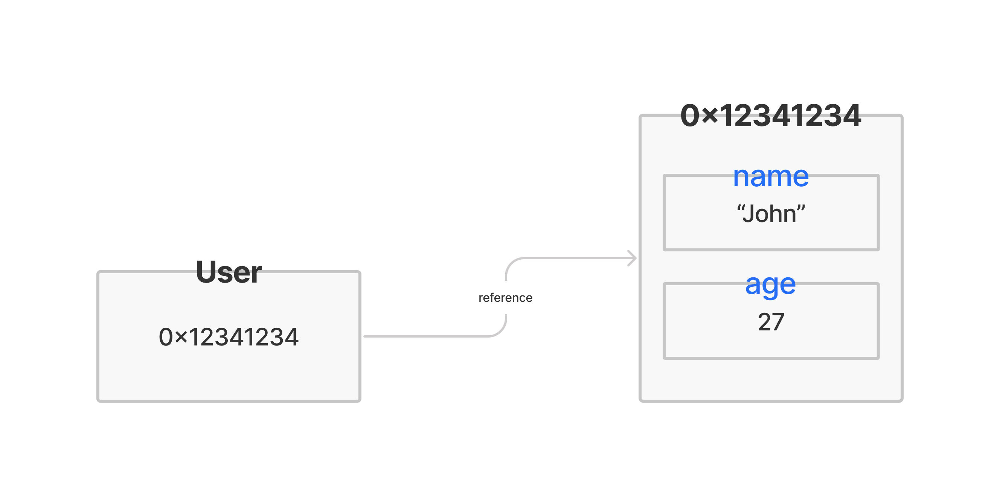
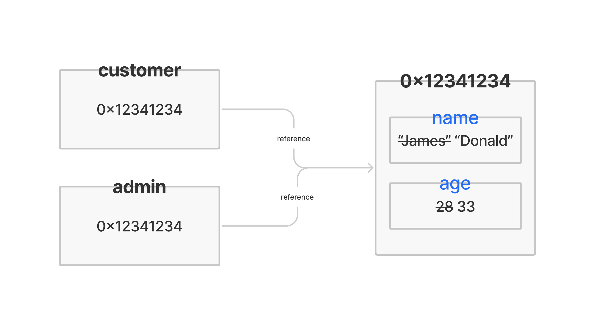
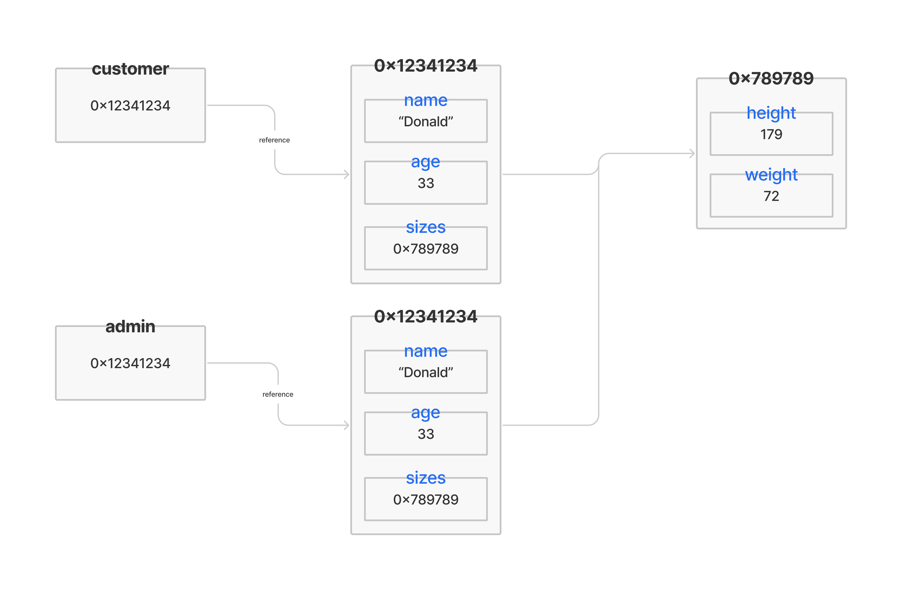

# JAVASCRIPT
> 👍 *기초를 탄탄하게🧱, 발목 잡히지 않도록.*

## 📌 개요
<!-- ### Basic
### Condition
### Iteration
### Function
### Basic Object -->

### 학습 환경 구축
#### Node.js
[Download](https://nodejs.org/ko/download/)
- V8(Javascript Engine)으로 빌드된 이벤트 기반 JS Runtime Platform
- 확장성 있는 네트워크 애플리케이션(특히, Server Side) 개발에 사용되는 SW Platform
- JS를 활용하며, Non-blocking I/O와 단일 스레드 이벤트 루프를 통한 높은 성능으로 처리가 가능하다.

#### Visual Studio Code
[Download](https://code.visualstudio.com/download)

#### LeetCode
[LeetCode](https://leetcode.com/)
- 온라인 기반으로 알고리즘 문제 풀이 및 토론 환경을 제공하는 플랫폼 사이트
- JS, C, C++, Python 등 14개의 인기 있는 코딩 언어를 지원
- Facebook, Apple, Intel, Amazon 등 해외 기업에서 SW 문제 해결 인터뷰 시 활용

### Javascript란?
- 객체(Object) 기반의 스크립트 프로그래밍 언어(Line by Line interpreter)
- ECMAScript 사양을 준수하는 범용 스크립팅 언어
- 웹의 동적 동작을 구현하기 위해 제작
- JS 엔진(Google V8, Firefox SpiderMonkey, Edge Chakra) 위에서 수행된다.

### ECMAScript란?
- ECMA International(정보통신에 대한 표준을 제정하는 비영리 표준화 기구)이 ECMA-262 기술 규격(범용 목적의 스크립트 언어 명세 기술)에 따라 정의하고 있는 표준화된 스크립트 프로그래밍 언어
- JS를 표준화하기 위해 만들어졌다.

### 코드의 동작 흐름
- 개발자 -> 스크립트 -> 컴퓨터


### Javascript 변환 절차
- Javascript 코드를 parser가 변환해서 Abstract Syntax Tree(추상 문맥 트리)로 변환되어 의미에 맞게 나누어진 후, 컴파일러 또는 인터프리터를 통해서 실제 컴퓨터가 이해할 수 있는 언어로 변환되고, 이를 CPU가 읽어서 실행한다.

## 📌 기본 입출력
- 사용자가 프로그램과 상호작용하기 위한 방법으로, 입력과 출력, 즉 Input/Output(I/O)를 의미한다.
- 운영체제에서의 대표적인 입출력은 표준 입력(stdin), 표준 출력(stdout), 표준 오류 출력이 있다.
  * **표준 입력(stdin)**
    일반적으로 컴퓨터의 키보드의 응답을 받아 입력
    프로그램의 데이터를 추가하기 위한 입력 장치
    알고리즘에서는 문제의 TestCase 입력을 위해 사용한다.
  * **표준 출력(stdout)**
    일반적으로 컴퓨터의 모니터에 문자열로 출력
    프로그램의 실행 상태 혹은 실행 결과를 보고 판단
    알고리즘에서는 문제의 정답 확인, 디버깅 용으로 사용한다.
```txt
Hello, world!
```

```javascript
const fs = require("fs");
const input = fs.readFileSync("./Javascript/input.txt", "utf8");

console.log(input);
```
> 이 경우, readFileSync에서 경로를 절대 경로로 지정해야 node.js로 출력이 가능한 것 같다.

## 📌 Javascript 기초 문법
### 코드 구성
- Javascript 문법은 스크립트 기반의 언어로, 다수의 표현식(Expression)과 하나의 명령문(Statement)로 이루어지며, 명령문으로 프로그램(Application)이 수행된다.
- 하나의 명령문(Statement)의 끝은 개행(`Enter`) 혹은 **세미콜론(`;`)**으로 표시한다.

### 예약어(Keyword)
[W3Schools](https://www.w3schools.com/js/js_reserved.asp)
- Javascript 문법을 만들 때 미리 정해진 용도로 동작하기 위해 정의된 단어.

### 식별자(Identifier)
- 스크립트에서 변수나 함수에 이름을 붙일 때 사용하는 단어.
- 대소문자를 구별하며, 유니코드 문자를 이용한다.
- **Javascript 식별자 규칙**
  * 예약어(Keyword) 사용 불가
  * 숫자로 시작 불가능
  * 특수문자는 `_`, `$`만 가능
  * 공백 포함 불가능

### 주석(Comments)
- 프로그램 구현 시 개발자의 설명 및 이해를 쉽게 도와주는 문장으로, 실제 코드의 실행에는 포함되지 않는다.
  `// 단일 행 주석`
  `/* 다중 행 주석 */`  
```javascript
console.log('hello'); // hello message(single line comments)

console.log("Hello");
/* Hello Message
Multi line
Comments
*/
```

## 📌 Javascript 변수와 상수
### 변수
- **변경 가능**한 값을 저장하기 위한 기억 공간(Memory)
- 사용하기 전 반드시 선언을 해야 한다.
- 중복해서 선언할 수 없다.
  *SyntaxError: Identifier '변수명' has already been declared* 발생
- 예약어(keyword) `let`을 활용한다.


### 상수
- **변경 불가능**한 값을 저장하기 위한 기억 공간(Memory)
- 사용하기 전 반드시 선언을 해야 한다.
- 중복해서 선언할 수 없다.
  *SyntaxError: Identifier '변수명' has already been declared* 발생
- 예약어(keyword) `const`을 활용한다.
- 값을 재할당할 수 없다.
  *TypeError: Assignment to constant variable.* 발생
- 상수의 경우 선언과 값 초기화를 동시에 해야한다.
  *SyntaxError: Missing initializer in const declaration* 발생


### Hoisting
- 코드에 선언된 변수 및 함수를 유효한 범위의 코드 상단으로 끌어올리는 작업을 의미한다.
- 예약어(keyword) `var`를 사용한 변수/함수의 선언만 위로 올려지고, 할당은 올려지지 않는다.
- 예약어(keyword) `let`, `const`로 선언한 변수/상수와 함수 표현식에서는 Hoisting 현상이 발생하지 않는다.
  *ReferenceError: Cannot access '변수명' before initialization* 발생

## 📌 Javascript 자료형
- 목적에 따라 특별한 성질이나 정해진 범주를 가지고 있는 데이터의 종류.
- 7가지의 원시형과 1가지의 객체형으로 구성된다.
### `typeof`
- 인수의 자료형을 반환하는 연산자/함수.
  연산자: `typeof x`
  함수: `typeof(x)`
### 자료형의 종류

| <center>DATA TYPE</center> | <center>DESC</center> | <center>CATEGORY</center> |
|:-:|:-|:-:|
|Boolean|논리적 값으로, `true`, `false`|원시 자료형(primitive type)|
|`null`|존재하지 않거나, 유효하지 않은 주소 표시|원시 자료형(primitive type)|
|`undefined`|선언 후 값을 할당하지 않은 변수|원시 자료형(primitive type)|
|number|정수, 실수 등의 숫자|원시 자료형(primitive type)|
|string|빈 문자열이나 글자들을 표현하는 문자열|원시 자료형(primitive type)|
|symbol|문자열과 함께 객체 property로 사용|원시 자료형(primitive type)|
|bigint|2<sup>53</sup>이상의 정수|원시 자료형(primitive type)|
|object|둘 이상의 복잡한 개체 저장 가능|객체형(object type)|

#### Boolean
- 논리적인 값을 표현하는 자료형.
- `true`, `false` 두 가지 값만 존재한다.
- 직접 사용하여 **flag 변수**로 활용할 수 있다.
- 주로 조건문 등에서 동작 판단의 기준으로 사용한다.
```javascript
let nameCheck = true;
let ageCheck = false;
let valueCheck = 10 > 3;    // true

console.log(nameCheck, ageCheck, valueCheck);
```

#### `null`
- 값이 비어 있음을 표현하는 자료형.
- 존재하지 않는(nothing), 비어 있는(empty), 알 수 없는(unknown) 값을 나타내는 데 활용한다.
- 하위 버전과의 호환성 문제를 해결하기 위해 `object` type으로 명시된다.

#### `undefined`
- 값이 할당되어 있지 않은 상태를 나타내는 자료형.
- 변수 선언 후 초기화하지 않은 경우에 `undefined`가 자동으로 할당된다.

#### number
- 정수, 부동소수점 숫자를 표현하는 자료형.
- 사칙연산을 할 수 있다. 다만, 부동소수점 숫자 연산은 완벽하지 않다.
- 일반적인 숫자 이외에 `Infinity`, `-Infinity`, `NaN`(Not a Number)와 같은 특수 숫자 값이 존재한다.
- 2<sup>53</sup>-1보다 큰 값은 bigint 자료형으로 표기한다.

#### string
- 문자, 문자열을 표현하는 자료형.
- 3가지 종류의 따옴표로 표현할 수 있다.
  `"_"` 큰 따옴표
  `'_'` 작은 따옴표
  ``_`` 역 따옴표(backtick), 문자열 내부에 변수를 활용할 수 있음.

#### object
- 다수의 원시 자료형(primitive type) 혹은 복잡한 개체(entity)를 표현하는 자료형.
- `Object()` 혹은 중괄호(`{}`)를 활용해 생성한다.
- `key: value` 구조를 가지며, 접근은 `objectName.keyName` 형태로 표현한다.

> 객체로 선언한 변수(`User`)에는 해당 데이터(`name`, `age`)가 각각 들어가는 것이 아니라, 해당 데이터를 보유한 Memory의 주소(`0x12341234`)가 할당된다.

- 객체에 개체(entity)를 추가하기 위해서는 `objectName.keyName = value;`으로 할 수 있고, 삭제는 `delete` 명령어를 활용해 할 수 있다.

##### 객체 자료형 복사의 문제
- 객체의 값을 복사하면, 대상 전체가 아닌, 주소 값만 복사되기 때문에 복사한 객체를 수정하면, 원본 객체도 수정되는 문제가 발생한다.
- 따라서 가리키는 객체 전체를 복사하기 위해서는 얕은 복사(Shallow Copy), 깊은 복사(Deep Copy)를  사용해야 한다.


##### 얕은 복사(Shallow Copy)
1. 반복문 `for`문을 활용한 객체의 얕은 복사(Shallow Copy)
   - [참고자료]()
2. Object.assign(피복사 객체, 복사 객체) 함수를 활용한 객체의 얕은 복사(Shallow Copy)
   - [참고자료](https://developer.mozilla.org/ko/docs/Web/JavaScript/Reference/Global_Objects/Object/assign)
3. Spread Operator를 활용한 객체의 얕은 복사(Shallow Copy)
   - [참고자료]()
4. 얕은 복사(Shallow Copy)의 문제점
   - 객체 내부에 또 다른 객체가 있는 경우, 복사되지 않는다.
   
##### 깊은 복사(Deep Copy)
- 객체 내부의 객체도 복사한다.
1. 재귀 함수(`for`문)를 이용한 객체의 깊은 복사
2. `JSON.parse(JSON.stringify(원본 객체))`를 이용한 객체의 깊은 복사

#### 형 변환
- Javascript는 자료형을 명시적으로 선언할 필요가 없다.
- 따라서, 연산자로 인한 계산이나 변수에 전달되는 값은 자동으로 암묵적인 형 변환이 실행된다.
- 다만, 강제적으로 자료형을 변환하려면, **자료형 함수**를 이용해 명시적으로 변환시켜야 한다.

##### 자료형 함수
1. `String()`
2. `Number()`, `parseInt()`, `parseFloat()`
3. `Boolean()`

## 📌 Javascript 연산자