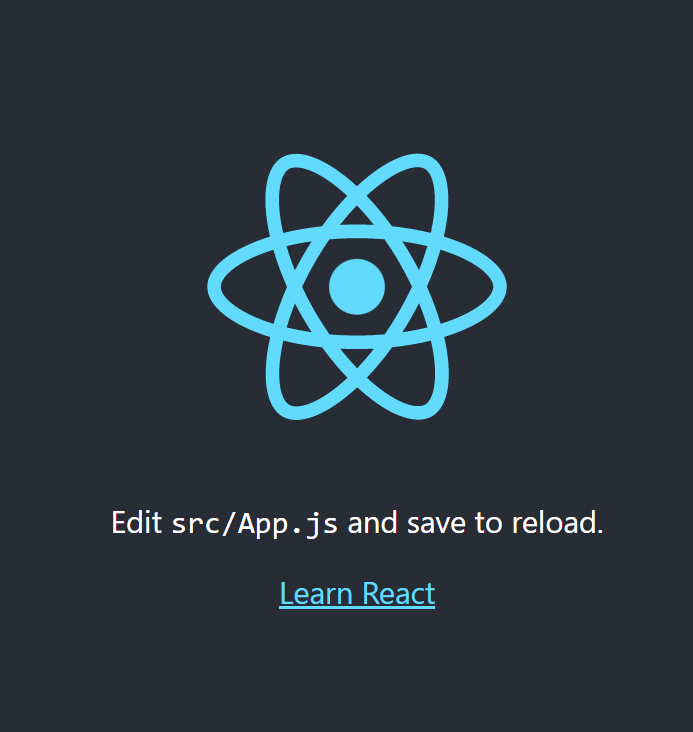

const [data, modifierFunction] = React.useState();
`modifierFunction` 함수를 실행하면 모든 Component가 다시 렌더링 된다.


## React `props`
각각의 Component를 만들어 재사용하는 것은 효율성을 높일 수 있다.
`props`는 일종의 방식으로, 부모 Component에서 자식 Component로 데이터를 보낼 수 있게 해주는 방식이다.

React에서 style을 변경하는 방법
1. 해당 Tag의 `style` 속성 수정(기본)
2. CSS 사용
3. 다른 라이브러리 활용

1번 방식을 활용하면, 모든 Tag에 복사-붙여넣기를 해야하고, 유지보수도 어렵다. 따라서 이러한 모든 Style들을 가지는 하나의 Component를 만드는 것이 더 효율적이다.
```jsx
function Btn(props) {
  return (
    <button>
      {props.text}
    </button>
  )
}

<Btn text="Save" />
<Btn text="Continue" />
```

하나의 Btn Component를 만들고, 여러번 사용(rendering)할 때, 부분적으로 차이를 주기 위해 `props`를 활용한다.
`props`는 하나의 객체로, Component를 사용할 때 추가적으로 작성한 정보를 받는다. 따라서 설정 가능한 Component를 만들어, HTML이나 Style을 최대한 재사용할 수 있게 해주는 것이 `props`이다.

이때 `props`를 확인해보면 다음과 같다.
```javascript
console.log(props);

> {text: "Save"} // object
```
이러한 `props`를 활용하려면 객체 활용 방법에 맞추어 `{props.text}`로 활용할 수 있다.

참고로, `<Btn text="Save" />`는 사실상 `Btn({text:"Save"})`와 같이 `Btn()` 함수에 인자(arguments)를 넣어 호출하는 것과 동일하다.

더 간편하게 활용하기 위해 다음과 같이 활용할 수 있다. ES6의 객체 문법을 활용해 객체명을 작성하지 않을 수 있다.
```jsx
function Btn({ text, big }) {
  return (
    <button style={{fontSize: big ? 18 : 12, }}>
      {text}
    </button>
  )
}
```
`props`로 문자열, `true` & `false`, `function` 등의 데이터를 전달할 수 있다. 이때 부모 Component의 state가 변경되면, 
```jsx
  function Btn({text, big, changeValue}) {
    return (
      <button style={{fontSize: big ? 18 : 12, } onClick={changeValue}}>
        {text}
      </button>
    )
  }

  function App() {
    const [value, setValue] = React.useState("Save");
    const changeValue = () => {
      setValue("Revert");
    }
    return (
      <div>
        <Btn text={value} big={true} onClick={changeValue} />
        <Btn text="Continue" />
      </div>
    );
  }
```
아래 `App` Component에서 활용된 `onClick`의 경우 단순한 `props`이지, 하나의 이벤트 리스너가 아님에 유의해야 한다. 즉, 부모 Component에서 작성한 것은 단지 `props`이며 결코 실제 HTML 태그 내부에 들어가지 않는다. 즉, 직접 `props`를 원하는 위치에 작성해야 한다.
이때, 버튼을 클릭함으로써 발생하는 `value` 값의 변화로 인해 부모 Component의 State 변경되고, 이에 따라 부모 Component는 모두 rerendering된다.
따라서 React Memo를 통해 관련된 `props`가 변경되지 않으면 해당 Component를 rerendering하지 않도록 설정할 수 있다.
JavaScript 문법 상 인수의 기본값을 설정할 수 있다.
```jsx
  function Btn({text, changeValue, fontSize = 10 }) {
    console.log(text, "was rendered.");
    return (
      <button style={{fontSize:fontSize}} onClick={changeValue}>
        {text}
      </button>
    )
  }

  const MemorizedBtn = React.memo(Btn);     // React Memo

  function App() {
    const [value, setValue] = React.useState("Save");
    const changeValue = () => {
      setValue("Revert");
    }
    return (
      <div>
        <MemorizedBtn text={value} changeValue={changeValue} />
        <MemorizedBtn text="Continue" />
      </div>
    );
  }
```

[`PropType`](https://unpkg.com/prop-types@15.7.2/prop-types.js)을 활용해 어떤 종류의 `props`를 받고 있는 지를 확인할 수 있다.
```html
<script src="https://unpkg.com/prop-types@15.7.2/prop-types.js" crossorigin></script>
```
```javascript
Btn.propTypes = {
  text: PropTypes.string.isRequired,    // 필수 props
  fontSize: PropTypes.number,           // 옵션 props
}
```
[여기](https://ko.reactjs.org/docs/typechecking-with-proptypes.html#proptypes)에서 테스트 가능한 `props`의 종류를 확인할 수 있다.

## CRA(Create React App)
[GitHub](https://github.com/facebook/create-react-app)
CRA(Create React App)는 수많은 스크립트와 사전 설정을 준비해주기 때문에 더 쉽게 React.js 어플리케이션을 만들 수 있다.

CRA(Create React App)를 활용하기 위해서는 우선 Node.js를 설치해야 한다. Node.js는 [여기](https://nodejs.org/en/)서 LTS 버전을 설치할 수 있다.

설치 후 아래 명령어를 활용해 Node.js 버전을 확인할 수 있다.
```
node -v
```
또한, `npx` Command를 작동시켜야 한다.
```
npx
```

CRA(Create React App) 활용해 새로운 프로젝트를 만들 수 있다.
```
npx create-react-app projectName
cd projectName
npm start
```
프로젝트를 만든 후, `package.json`을 열어보면 실행시킬 수 있는 script를 확인할 수 있다.
```json
...
"scripts": {
  "start": "react-scripts start",
  "build": "react-scripts build",
  "test": "react-scripts test",
  "eject": "react-scripts eject"
},
...
```
이후 터미널을 열고, 해당 폴더에서 `npm run start` 혹은 `npm start` 명령어를 통해 개발용 서버(Development Server)를 만들 수 있다.
```
npm run start
```
```
npm start
```
`http://localhost:3000/`의 주소를 가지고 열리는 페이지가 CRA(Create React App)를 통해 만든 어플리케이션의 초기 버전이다.([에러](https://exerror.com/plugin-react-was-conflicted-between-package-json-eslint-config-react-app/))


프로젝트 이름으로 명명된 폴더 내의 `src` 폴더가 모든 프로젝트 작성 파일이 속할 곳이다.
해당 폴더 내의 
즉, 이러한 모든 어플리케이션은 이미 설정된 바에 따라서  CRA에 의해 `public` 폴더의 `index.html`의 `#root` `<div>` 태그(`<div id="root"></div>`) 내에 들어가게 된다.

또한, CRA를 활용하면, Auto Reload가 되는 장점이 있다. 만약 `App.js`에서 일부를 변경하면 자동으로 웹 페이지에서도 변경된다는 것이다.

초기 개발을 준비하기 위해 어플리케이션을 깔끔하게 정리해야 한다.
1. `App.js`, `index.js`의 불필요한 코드 제거
2. `App.css`, `App.test.js`, `index.css`, `logo.svg`, `reportWebVitals.js`, `setupTests.js` 파일을 삭제

`Node.js`로 작업하기 때문에 파일을 각각 분리할 수 있고, 더 조직적으로 구성하여 하나의 파일로 Component를 구성하고 이를 `import` 하는 방식으로 만들 수 있다.

