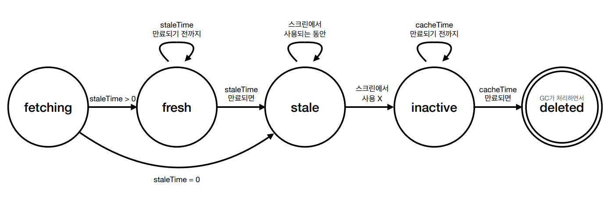
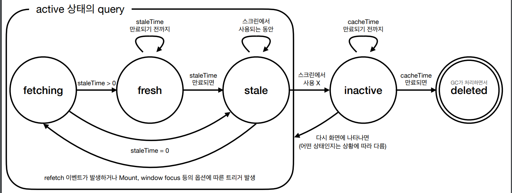

# React Query와 상태 관리

## 상태

주어진 시간에 대한 시스템, 즉, 문자열, 배열, 객체 등의 형태로 어플리케이션에 저장된 데이터를 나타내는 것으로, 언제든지 변경될 수 있다.

따라서, 개발자의 입장에서는 오너십을 가지고 관리해야 할 데이터라고 볼 수 있다.

UI/UX의 중요성이 높아지고, 프로덕트의 규모가 커질수록 FE에서 수행하는 역할이 늘어나게 된다. 따라서 관리하는 상태가 많아지게 됐다.

이렇게 상태가 많아지고, 시간에 따라 변화하므로 상태들의 조합들도 늘어나게 되면서 체계적으로 관리할 필요성이 높아졌다. 하지만 React에서는 단방향 바인딩 방식을 가지고 있기 때문에 Props Drilling 이슈 등을 야기했다. 그러므로 Redux, MobX, Recoil 등 여러 상태 관리 라이브러리 혹은 Context API 등을 활용해 이를 해결하고자 했다.

다만, 이러한 상태 관리 라이브러리를 사용하는 여러 레거시 코드들에서는 Store에서 전역 상태를 관리하기 보다 API 통신 코드가 많은 것을 여러 개발자들이 지적하고, 문제로 인식하고 있다. 이전 프로젝트를 진행할 때 팀원들이 작성한 Redux Store에도 포트폴리오나 로그인 정보 등에 관련된 API 통신을 하는 코드가 대부분이었다는 것을 보면, 전역 상태 관리와는 맞지 않는 것이 아닌가 하는 생각이 든다.

눈을 감고 전역 상태 관리라고 생각하면서 보더라도 반복되는 isFetching, isLoading, isError 등 API 관련 상태와 비슷한 구조의 API 통신 코드를 Store에 작성하면서 서버 값을 저장하는 것이 맞는가에 대해 다양한 개발자들이 고민했다고 한다.

이렇게 전역 상태 관리 방식에 대해 결정하기 전에 다양한 상태를 구분하여 관리하는 것의 필요성을 느끼게 되었으며, 결국 Server State와 Client State를 구분하게 되었다.

### Server State

- Client에서 제어하거나 소유되지 않은 원격의 공간에서 관리되고 유지되는 상태
- Fetching, Updating에 비동기 API가 필요한 상태
- 다른 사람들과 공유되는 데이터로 User가 모르는 사이에 변경될 수 있는 상태
- 신경쓰지 않으면 잠재적으로 'out of date'가 될 가능성을 지닌 상태

이러한 특성을 가진 상태들은 사실상 FE에서는 일종의 캐시이다.

### Client State

- Client에서 소유하며 온전히 제어할 수 있는 상태
- 초기값 설정이나 조작에 제약 사항이 없는 상태
- 다른 사람들과 공유되지 않으며 Client 내에서 UI/UX 흐름이나 User의 인터렉션에 따라 가변하는 상태
- 항상 Client 내에서 최신 상태로 관리되는 상태

이렇게 Server State와 Client State로 구분되는 상태를 기존의 Redux, MobX, Recoil 등과 같은 전역 상태 관리 라이브러리로 관리하기 적합하지 않다.

## React Query

> React Query is often described as the missing data-fetching library for React but in more technical terms, it makes fetching, caching, synchronizing and updating server state in your React applications a breeze

React Query는 공식 문서에서 말하듯 React 어플리케이션에서 Server State를 가져오고, 캐시하고, 동기화하고, 업데이트할 수 있게 해준다. 또한, config없이 즉시 사용 가능하다.(물론 커스텀할 수 있다.)

### Queries

- Query는 비동기적 데이터에 선언적으로 의존한다.
- Query는 데이터를 가져오는 Promise와 함께 사용된다.
- 서버의 데이터를 수정하는 메서드의 경우에는 Mutations을 활용하는 것이 권장된다.

```javascript
import { useQuery } from 'react-query';

const App () => {
  const info = useQuery('todos', fetchTodoList);  // Query Key, Query Function
}
```

Query를 사용하기 위한 `useQuery` Hook은 기본적으로 두 가지 인자를 받는다.

#### Query Key

첫 번째 인자인 Query Key에 따라 Query Caching을 관리하게 된다. 보통 String 혹은 Array의 형태로 사용된다.

```javascript
useQuery('todos');

useQuery(['todo', 5]);

useQuery(['todo', 5], { preview: true });

useQuery(['todo', 5], { type: 'done' });
```

실무적으로는 Array 형태로 주로 사용되는 경우가 많다. 특히 Pagination 등을 구현할 때 Array 형태가 많이 사용된다.

#### Query Function

두 번째 인자는 Query Function는 Promise를 반환하는 함수로 데이터를 `resolve하거나` `error를` `throw`하는 함수이다. 즉, `fetch`, `axios` 등 API fetching 함수이다.

#### Return Values

이렇게 두 가지 인자(parameter)를 전달받아 useQuery는 Redux를 사용한다면 모두 구현해주어야 할 유용한 인터페이스를 반환한다.

- data: 마지막으로 성공한 resolved된 데이터(Response)
- error: 에러가 발생했을 때 반환되는 에러 객체
- isFetching: Request가 in-flight 중인 경우를 나타내는 Boolean 데이터
- status, isLoading, isSuccess 등: 현재 Query의 상태를 나타내는 데이터
- refetch: 해당 Query를 다시 fetching하는 함수(특정 이벤트에 따라 fetching하게끔 하는 함수)
- remove: 해당 Query Cache에서 지우는 함수
- etc.

#### Options

추가적으로 세 번째 인자에 Query Options를 전달하여 config를 커스텀할 수 있다.

- onSuccess, onError, onSettled: Query Fetching의 성공, 실패, 완료 시 실행할 Side Effects를 정의하는 옵션
- enabled: 자동으로 Query를 실행시킬지 말지 여부를 결정하는 옵션(기본적으로는 컴포넌트가 마운트되는 시점에 실행되는데, 이를 막는 옵션)
- retry: Query 동작 실패 시, 자동으로 retry할 지 여부를 결정하는 옵션
- select: Query 성공 시 가져온 data를 전달할 때 가공하는 옵션
- keepPreviousData: 새롭게 Fetching 시 이전 데이터의 유지 여부를 결정하는 옵션
- refetchInterval: 주기적으로 refetch할 지 여부를 결정하는 옵션
- etc.

`queries.js`로 분리하여 Query 선언부를 컴포넌트와 분리하여 관리하는 것이 조금 더 편의성을 높일 수 있는 방식이다.

```javascript
// queries.js
export const useFetchOrder = (orderNo, options) =>
  useQuery('fetchOrder', () => fetchOrder(orderNo), options);

// components.js
const fetchOrderResult = useFetchOrder(orderNo, {
  onSuccess: (fetchOrderResultData) => {
    // 로직
  },
  onError: (fetchOrderResultData) => {
    // 로직
  },
});
```

여러 Query를 같이 사용할 수도 있다.

```javascript
const App () => {
  const usersQuery = useQuery('users', fetchUsers);
  const teamsQuery = useQuery('teams', fetchTeams);
  const projectsQuery = useQuery('projects', fetchProjects);
}
```

### Mutations

데이터를 `create`, `update`, `delete`할 때 사용하며, `useMutation` Hook으로 활용할 수 있다. Promise 반환 함수를 인자로 전달하여 사용한다.

```javascript
const mutation = useMutation((newTodo) => {
  return axios.post('./todos', newTodo);
});
```

Query Key를 함께 작성해주면 devtools에서도 확인이 가능하다.

#### Return Values

- mutate: mutation을 실행하는 함수(자동으로 mutation이 실행되지 않기 때문)
- mutateAsync: mutate와 유사한 기능을 하지만, Promise를 반환하는 함수
- reset: mutation 내부 상태를 비우는 함수
- 이외는 대부분 useQuery와 유사한 데이터를 반환한다.

#### Options

- onMutate: 본격적인 mutation 동작 이전에 먼저 동작하는 함수로, Optimistic Update(API 통신이 성공할 것으로 낙관적으로 추측하고 UI를 먼저 업데이트하는 방식) 를 적용할 때 유용하게 활용된다.
- 이외는 대부분 useQuery와 유사한 옵션을 활용한다.

### Query Invalidation

간단하게 `queryClient`를 통해 `invalidateQueries` 메서드를 호출하면 된다. 인자로 받은 해당 Query Key를 가진 Query는 낡은 것으로 취급되고, 현재 렌더링되고 있는 Query들은 백그라운드에서 refetch된다.

```javascript
queryClient.invalidateQueries(); // Query Key 생략 시 모든 Query를 의미

queryClient.invalidateQueries('todos');
```

### Caching과 Synchronization

Caching과 Synchronization을 위해 Options에서 `cacheTime`, `staleTime`, `refetchOnWindowFocus`, `refetchOnMount` 등의 옵션이 존재한다.

React Query는 HTTP Cache-Control Extensions for Stale Content인 **RFC 5861**에 있는 stale-while-revalidate의 아이디어를 차용했다. 백그라운드에서 stale response를 revalidate하는 동안 캐시가 가진 stale response를 반환하는 개념이다. 즉, 데이터를 조회하는 경우 Loader 등이 아닌 이전의 stale data를 보여주고, 그동안 백그라운드에서 refetch하면서, 설정된 시간이 종료되기 전에 다시 받아온 데이터를 보여주는 방식이다.

이러한 방식을 메모리 캐시에도 적용한 것이 React Query, SWR 등의 라이브러리이다.

- `cacheTime`: 메모리에 얼마동안 있을 건지 여부를 결정하는 옵션(해당 시간이 지난 이후 GC(Garbage Collector)에 의해 처리되고, default 값은 `600`, 5분이다.)
- `staleTime`: 얼마의 시간이 흐른 후에 데이터를 stale data로 취급할 것인지를 결정하는 옵션(default 값은 `0`)
- `refetchOnMount`, `refetchOnWindowFocus`, `refetchOnReconnect`: Mount, Window focus, reconnect 시점에 data가 stale이라고 판단되면 모두 refetch하는 옵션(default 값은 `true`)

데이터의 최신성이 중요한 부분에서는 많이 사용하지 않는다.




### Zero-Config

다만 일부 옵션의 기본 값은 알고 있어야 편리하게 사용할 수 있다.

- staleTime: `0`
- cacheTime: `60 x 5 x 1000`
- refetchOnMount, refetchOnWindowFocus, refetchOnReconnect: `true`
- retry: `3`
- retryDelay: exponential backoff function
